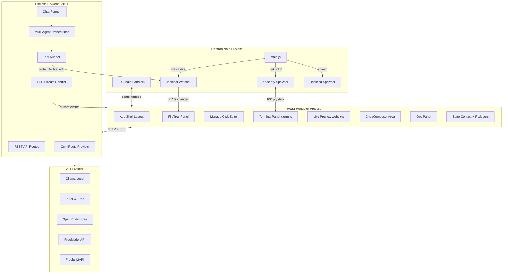
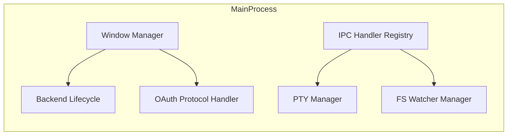
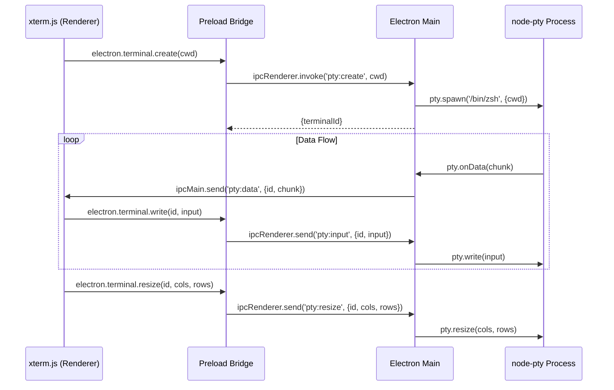
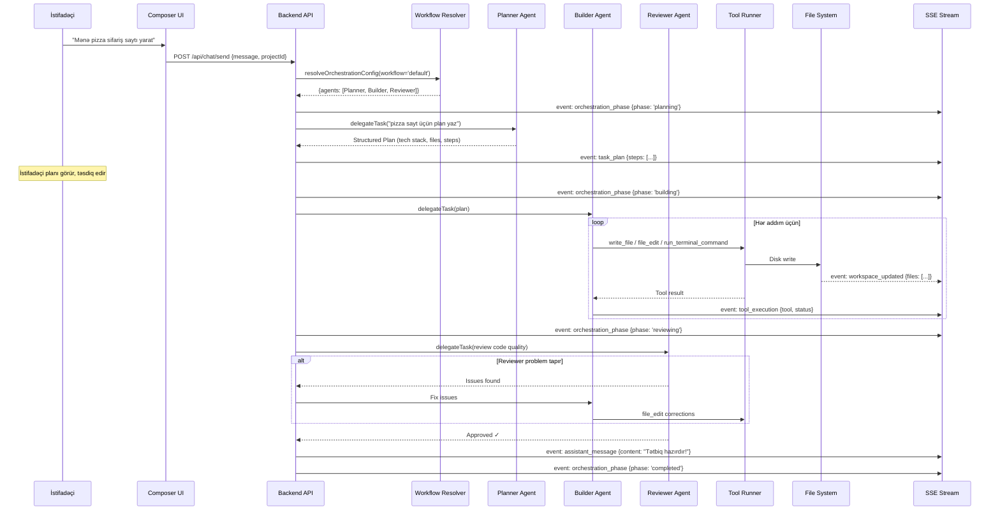
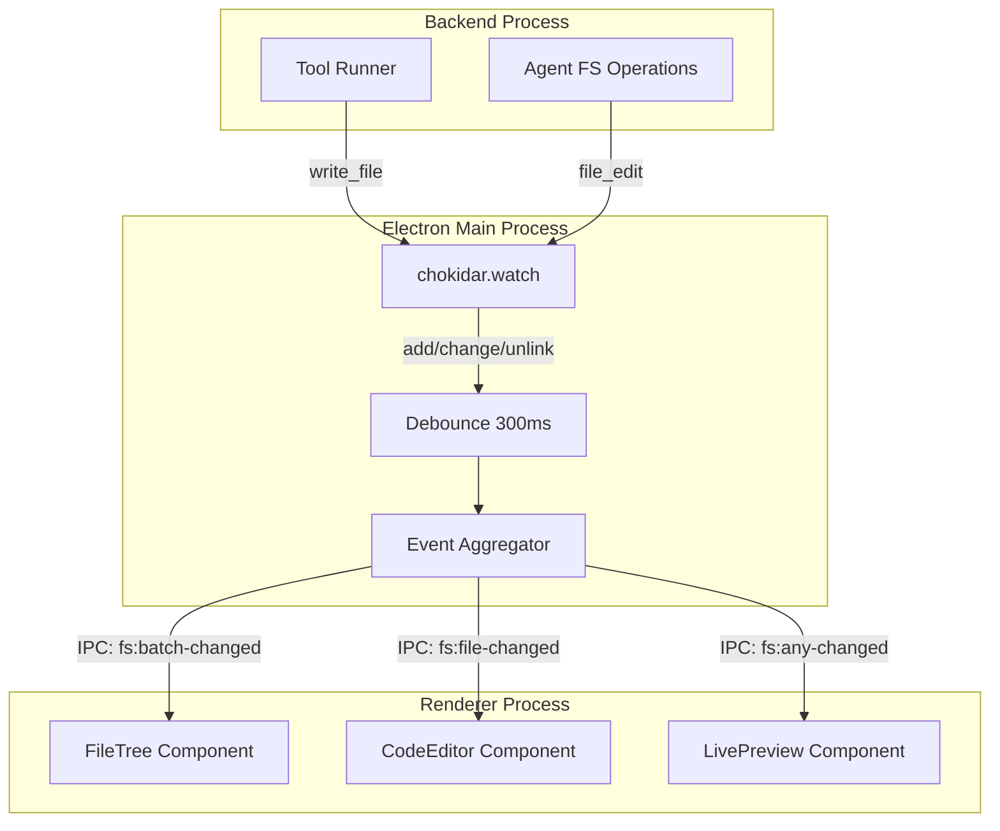
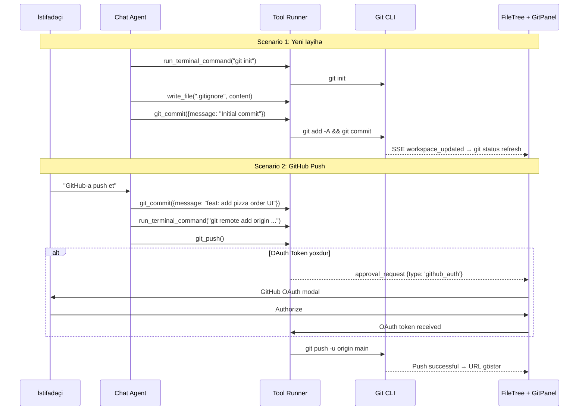
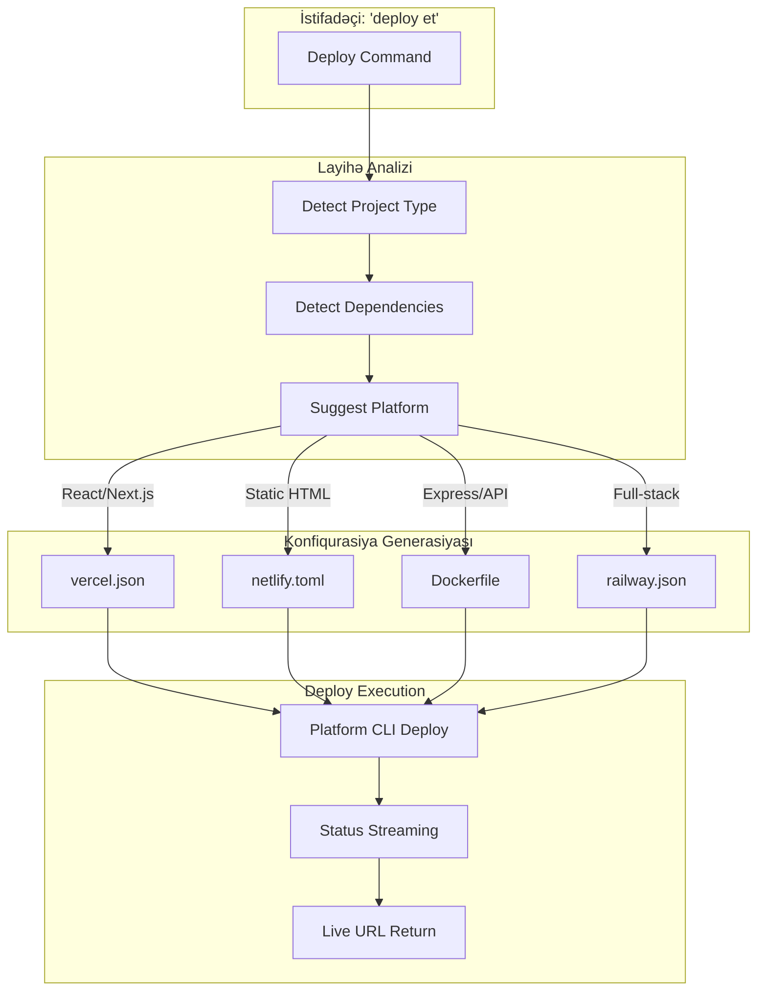
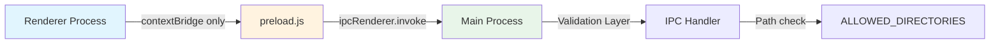
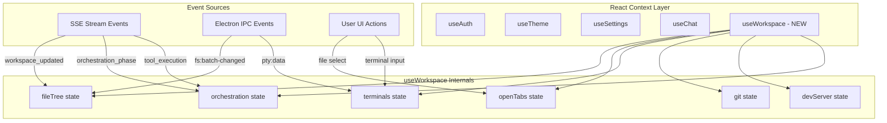

# Design Document: BahAI Desktop App Builder

## Overview

Bu sənəd BahAI Desktop App Builder-in texniki dizaynını müəyyənləşdirir. Sistem Electron shell daxilində tam IDE-tipli AI-powered tətbiq yaradıcısı təqdim edir. Mövcud arxitektura üzərində qurulur: Express backend (localhost:3001), React+Vite frontend, Electron main process, çox-agentli orkestrasiya sistemi (Planner → Builder → Reviewer), və OmniRoute provider routing.

Əsas texniki qərarlar:
- **IPC Layer**: Electron `contextBridge` + `ipcRenderer.invoke` pattern (mövcud preload.js genişləndirilir)
- **State Management**: React Context + useReducer (lightweight, SSE-driven state updates)
- **File Watching**: `chokidar` backend-də, SSE `workspace_updated` event-ləri ilə frontend-ə ötürülür
- **Editor**: Monaco Editor (artıq lazy-loaded, genişləndirilir)
- **Terminal**: xterm.js + node-pty (Electron main process-dən PTY fork)
- **Live Preview**: Electron `<webview>` tag with dev server proxy

## Architecture



## Components and Interfaces

### 1. Electron Main Process (electron/main.js)

**Məsuliyyət**: Window management, backend lifecycle, IPC bridge, PTY management, file system watching.



**Genişləndirmə planı** (mövcud `electron/main.js` üzərinə):

| Modul | Fayl | Funksiya |
|-------|------|----------|
| PTY Manager | `electron/ptyManager.js` | node-pty spawn/resize/kill, IPC relay |
| FS Watcher | `electron/fsWatcher.js` | chokidar instance management, debounced events |
| IPC Registry | `electron/ipcHandlers.js` | Bütün `ipcMain.handle` / `ipcMain.on` registrations |
| Git Helper | `electron/gitHelper.js` | simple-git wrapper for UI-level git ops |

### 2. FileTree Component

**Texnologiya**: React virtualized tree (react-arborist) + IPC file system events.

```typescript
interface FileNode {
  id: string;           // relative path as unique key
  name: string;         // basename
  type: 'file' | 'directory';
  children?: FileNode[];
  gitStatus?: 'modified' | 'added' | 'deleted' | 'untracked' | 'clean';
  isOpen?: boolean;     // directory expanded state
}

interface FileTreeProps {
  workingDirectory: string;
  onFileSelect: (path: string) => void;
  onFileCreate: (path: string) => void;
  onFileDelete: (path: string) => void;
  onFileRename: (oldPath: string, newPath: string) => void;
  gitStatusMap: Record<string, string>;
}
```

**Data flow**:
1. Component mount → `window.electron.readDirectory(workingDir)` IPC call
2. Main process `fs.readdir` recursive (max depth 3 initially, lazy-load deeper)
3. `chokidar` events → IPC `fs:changed` → incremental tree update
4. Git status overlay: periodic `git status --porcelain` (every 5s or on fs change)

### 3. CodeEditor Component (Monaco)

**Mövcud**: `frontend/src/components/chat/CodeEditor.tsx` — artıq lazy-loaded.

**Genişləndirmə**:

```typescript
interface CodeEditorProps {
  filePath: string;
  workingDirectory: string;
  onClose: () => void;
  // New props for Desktop App Builder:
  onSave?: (content: string) => void;
  onDirtyChange?: (isDirty: boolean) => void;
  externalContent?: string;        // agent-driven content updates
  externalVersion?: number;        // conflict detection version counter
  readOnly?: boolean;
  tabs?: EditorTab[];              // multi-tab support
  activeTabId?: string;
}

interface EditorTab {
  id: string;
  filePath: string;
  label: string;
  isDirty: boolean;
  language: string;
}
```

**Key behaviors**:
- Multi-tab: her açılan fayl üçün tab yaradılır, max 12 tab (LRU eviction)
- External update: Agent `write_file`/`file_edit` etdikdə, `externalContent` prop update olunur → Monaco `model.setValue()` with undo stack preserved
- Conflict resolution: version counter mismatch → "File changed externally" banner
- Auto-save: 2s debounce on keystroke → IPC `fs:writeFile`

### 4. TerminalPanel (xterm.js + node-pty)

**Arxitektura**:



```typescript
// electron/ptyManager.js - Main process
interface PtySession {
  id: string;
  pty: IPty;
  cwd: string;
  createdAt: number;
}

// Frontend terminal component
interface TerminalPanelProps {
  projectPath: string;
  isVisible: boolean;
  onClose: () => void;
  // New:
  splitMode?: 'horizontal' | 'vertical';
  maxTerminals?: number;  // default 4
}
```

**Multi-terminal**: Tabbed terminal UI, max 4 sessions. Agent `run_terminal_command` uses a dedicated agent terminal (visual distinction with colored border).

### 5. LivePreview Component

**Mövcud**: `frontend/src/components/chat/LivePreview.tsx` — port-based iframe.

**Genişləndirmə üçün dizayn**:

```typescript
interface LivePreviewProps {
  port?: number;
  isVisible: boolean;
  onClose: () => void;
  // New Desktop App Builder props:
  responsiveMode?: 'desktop' | 'tablet' | 'mobile';
  showUrlBar?: boolean;
  showConsoleOverlay?: boolean;
  onNavigate?: (url: string) => void;
  onConsoleError?: (error: ConsoleError) => void;
}

interface ConsoleError {
  message: string;
  source: string;
  line: number;
  column: number;
  timestamp: number;
}
```

**Implementation details**:
- Electron desktop: `<webview>` tag with `partition="persist:preview"` (izolə edilmiş session)
- Web fallback: `<iframe sandbox="allow-scripts allow-same-origin">`
- Responsive modes: CSS `transform: scale()` + container width constraints
- Console overlay: `webview.addEventListener('console-message')` → overlay panel
- URL bar: Navigation within the preview, back/forward/refresh buttons
- Auto-reload: SSE `workspace_updated` event → `webview.reload()` (debounced 1s)

### 6. Chat & Composer Area

**Mövcud**: `ChatArea` + `Composer` components — dəyişiklik tələb olunmur. Desktop App Builder rejimində yan panellərlə birlikdə çalışır.

**Desktop-specific layout**: `productMode === 'desktop_code'` olduqda panellər aktivdir (mövcud `allowDesktopAuxPanels` logic).

### 7. OpsPanel (Orchestration Visibility)

**Mövcud**: `OpsPanel` component — Planner artifact, execution artifacts, approvals göstərir.

**Genişləndirmə**: Step-by-step progress visualization:

```typescript
interface OrchestrationStep {
  id: string;
  agent: 'Planner' | 'Builder' | 'Reviewer';
  status: 'pending' | 'running' | 'completed' | 'failed' | 'skipped';
  description: string;
  startedAt?: number;
  completedAt?: number;
  artifacts?: string[];   // file paths created/modified
  toolCalls?: ToolCallSummary[];
}
```

## Data Flow Diagrams

### User Prompt → Result (Full Pipeline)



### File System Watcher Architecture



**Watcher configuration**:

```javascript
// electron/fsWatcher.js
const watcherConfig = {
  ignored: [
    '**/node_modules/**',
    '**/.git/**',
    '**/dist/**',
    '**/build/**',
    '**/.next/**',
    '**/venv/**',
    '**/__pycache__/**'
  ],
  persistent: true,
  ignoreInitial: true,
  awaitWriteFinish: {
    stabilityThreshold: 200,
    pollInterval: 50
  },
  depth: 10
};
```

**Batching strategy**: 
- 300ms debounce window for batch aggregation
- Max batch size: 50 events (beyond = full tree refresh signal)
- Separate channels: `fs:batch-changed` (FileTree), `fs:file-changed` (specific file for Editor)

### Git Integration Flow



### Deploy Pipeline Architecture



**Deploy decision matrix**:

| Project Type | Primary Platform | Config File | CLI Command |
|---|---|---|---|
| React SPA / Next.js | Vercel | `vercel.json` | `npx vercel --prod` |
| Static HTML/CSS | Netlify | `netlify.toml` | `npx netlify deploy --prod` |
| Express / Node.js API | Railway | `railway.json` | `railway up` |
| Full-stack (frontend + API) | Railway | `Dockerfile` | `railway up` |
| Python Flask/FastAPI | Railway | `Dockerfile` + `requirements.txt` | `railway up` |

## Data Models

### Project State

```typescript
interface Project {
  id: string;
  name: string;
  path: string;                    // absolute filesystem path
  createdAt: string;
  lastOpenedAt: string;
  lastPort?: number;               // dev server port
  gitRemote?: string;              // GitHub URL
  gitBranch?: string;              // current branch
  template?: string;               // scaffold template used
  deployUrl?: string;              // last successful deploy URL
  deployPlatform?: string;
}
```

### Workspace State (Runtime)

```typescript
interface WorkspaceState {
  projectId: string;
  fileTree: FileNode[];
  openTabs: EditorTab[];
  activeTabId: string | null;
  terminals: TerminalSession[];
  activeTerminalId: string | null;
  devServer: {
    port: number | null;
    status: 'stopped' | 'starting' | 'running' | 'error';
    url: string | null;
  };
  gitState: {
    branch: string;
    isDirty: boolean;
    statusMap: Record<string, GitFileStatus>;
    ahead: number;
    behind: number;
  };
  orchestration: {
    phase: 'idle' | 'planning' | 'building' | 'reviewing' | 'completed' | 'failed';
    steps: OrchestrationStep[];
    currentStepId: string | null;
  };
}
```

### SSE Event Types (Shared Wire Contract)

Mövcud `shared/contract.js` event tipləri:

| Event | Payload | Triggered By |
|-------|---------|--------------|
| `assistant_delta` | `{content: string}` | Streaming LLM response |
| `assistant_message` | `{content: string, role: 'assistant'}` | Final message |
| `tool_execution` | `{tool: string, args: object, status: string}` | Tool Runner |
| `tool_result` | `{tool: string, result: string}` | Tool Runner |
| `task_plan` | `{steps: PlanStep[]}` | Planner Agent |
| `orchestration_phase` | `{phase: string, agent: string}` | Orchestrator |
| `orchestration_state` | `{agents: string[], currentAgent: string}` | Orchestrator |
| `workspace_updated` | `{files: FileChange[]}` | FS Watcher / Tool Runner |
| `approval_request` | `{id: string, type: string, description: string}` | Safe Mode |
| `error` | `{message: string, code?: string}` | Any component |

## IPC Protocol

### Electron IPC Channel Registry

Mövcud preload.js genişləndirilir. Bütün IPC əməliyyatları `electron` namespace altında expose olunur:

```typescript
// electron/preload.ts - Extended API
interface ElectronBridge {
  // Existing
  isDesktop: true;
  pickDirectory: () => Promise<string | null>;
  onOpenSettings: (cb: () => void) => () => void;
  onNewChat: (cb: () => void) => () => void;
  onAuthCallback: (cb: (payload: AuthPayload) => void) => () => void;

  // New: File System
  fs: {
    readDirectory: (dirPath: string, depth?: number) => Promise<FileNode[]>;
    readFile: (filePath: string) => Promise<string>;
    writeFile: (filePath: string, content: string) => Promise<void>;
    deleteFile: (filePath: string) => Promise<void>;
    rename: (oldPath: string, newPath: string) => Promise<void>;
    createDirectory: (dirPath: string) => Promise<void>;
    watchStart: (dirPath: string) => Promise<void>;
    watchStop: () => Promise<void>;
    onFileChanged: (cb: (event: FSEvent) => void) => () => void;
    onBatchChanged: (cb: (events: FSEvent[]) => void) => () => void;
  };

  // New: Terminal (PTY)
  terminal: {
    create: (cwd: string) => Promise<{terminalId: string}>;
    write: (terminalId: string, data: string) => void;
    resize: (terminalId: string, cols: number, rows: number) => void;
    kill: (terminalId: string) => Promise<void>;
    onData: (cb: (payload: {id: string, data: string}) => void) => () => void;
    onExit: (cb: (payload: {id: string, code: number}) => void) => () => void;
  };

  // New: Git (UI-level operations)
  git: {
    status: (cwd: string) => Promise<GitStatusResult>;
    log: (cwd: string, limit?: number) => Promise<GitLogEntry[]>;
    diff: (cwd: string, file?: string) => Promise<string>;
    branch: (cwd: string) => Promise<{current: string, all: string[]}>;
  };

  // New: Shell integration
  shell: {
    openExternal: (url: string) => void;
    openPath: (filePath: string) => void;
    showItemInFolder: (filePath: string) => void;
  };

  // New: App lifecycle
  app: {
    getVersion: () => string;
    getPlatform: () => string;
    getUserDataPath: () => string;
  };
}
```

### IPC Security Model



**Təhlükəsizlik qaydaları**:
1. `contextIsolation: true` — renderer heç vaxt Node.js API-yə birbaşa müraciət edə bilmir
2. Bütün path arguments `ALLOWED_DIRECTORIES` siyahısına qarşı yoxlanır
3. PTY sessions yalnız allowed directories daxilində `cwd` qəbul edir
4. File watcher yalnız aktiv project directory-ni izləyir
5. `nodeIntegration: false` saxlanır (mövcud konfiqurasiya)

## State Management

### Arxitektura: Context + Reducer Pattern

Mövcud arxitektura: `useChat`, `useSettings`, `useAuth`, `useTheme` custom hooks. Desktop App Builder üçün yeni `useWorkspace` hook əlavə olunur.



### useWorkspace Hook Interface

```typescript
interface UseWorkspaceReturn {
  // File tree
  fileTree: FileNode[];
  refreshFileTree: () => Promise<void>;
  
  // Editor tabs
  openTabs: EditorTab[];
  activeTab: EditorTab | null;
  openFile: (path: string) => void;
  closeTab: (tabId: string) => void;
  setActiveTab: (tabId: string) => void;
  
  // Terminals
  terminals: TerminalSession[];
  activeTerminal: TerminalSession | null;
  createTerminal: () => Promise<string>;
  killTerminal: (id: string) => void;

  // Git
  gitState: GitState;
  refreshGitStatus: () => Promise<void>;
  
  // Dev server
  devServer: DevServerState;
  
  // Orchestration progress
  orchestration: OrchestrationState;
  
  // Layout
  panelLayout: PanelLayout;
  setPanelSize: (panel: string, size: number) => void;
  togglePanel: (panel: string) => void;
}
```

### State Update Flow

1. **SSE Events** → `useChat` hook receives SSE → dispatches to `useWorkspace` reducer via shared event bus
2. **IPC Events** → `useEffect` in `useWorkspace` registers IPC listeners → dispatch to local reducer
3. **User Actions** → Direct dispatch to reducer from UI event handlers
4. **Persistence**: Panel sizes, open tabs, last active project → `localStorage` (survives app restart)

## Security Considerations

### 1. Sandbox Boundaries

| Layer | Məhdudiyyət | Enforcement |
|-------|------------|-------------|
| Electron Main | `ALLOWED_DIRECTORIES` path validation | `isPathSafe()` helper |
| Backend ToolRunner | Same `isPathSafe()` + `isBashCommandSafe()` | Runtime check before exec |
| PTY Manager | `cwd` validation against allowed dirs | Main process check |
| LivePreview | `partition="persist:preview"` isolated session | Electron webview config |
| File Watcher | Only watches current project directory | Explicit scope on start |

### 2. Command Blocklist

Backend `isBashCommandSafe()` already blocks:
- `rm -rf /`, `format`, `shutdown`, `reboot`
- Commands targeting paths outside workspace
- Pipe chains to sensitive system paths

### 3. Agent Isolation

- Hər layihə öz `workingDirectory` ilə sandboxed
- Cross-project file access mümkün deyil (backend path validation)
- Terminal sessions project-scoped `cwd` ilə spawn olunur
- Agent session audit log: hər tool call `execution_artifacts` cədvəlinə yazılır

### 4. Network Security

- LivePreview webview: `allowpopups="false"`, no Node.js integration
- Backend yalnız `127.0.0.1:3001` dinləyir (external access yoxdur)
- OAuth tokens: Electron keychain storage (production), localStorage (dev)
- SSE connection: same-origin only, session-based auth

## Performance Considerations

### 1. Lazy Loading Strategy

| Component | Load Trigger | Bundle Size Impact |
|-----------|-------------|-------------------|
| Monaco Editor | First file open | ~2.5MB (worker-based, async) |
| xterm.js | Terminal panel toggle | ~400KB |
| FileTree (react-arborist) | App mount in desktop mode | ~50KB |
| LivePreview | Dev server detected | Minimal (webview tag) |
| Mermaid (OpsPanel) | Plan visualization | ~800KB (optional) |

Mövcud pattern saxlanır: `React.lazy()` + `<Suspense>` (App.tsx-də artıq tətbiq olunub).

### 2. File Tree Performance

- **Virtualization**: react-arborist uses windowed rendering (only visible nodes in DOM)
- **Lazy directory expansion**: Directories loaded on-demand (user click or agent activity)
- **Initial depth limit**: 3 levels on mount, deeper on expand
- **Large workspaces**: > 10,000 files → show warning, increase debounce to 1s

### 3. Monaco Editor Optimization

- **Single editor instance**: Reuse model, switch `uri` on tab change (avoid mount/unmount)
- **Web workers**: Monaco language services run in separate worker thread
- **Diff only on demand**: `editor.createDiffEditor()` yalnız git diff görünüşündə
- **Large file warning**: > 1MB files → read-only mode with "Open in external editor" option

### 4. Terminal Performance

- **Scrollback limit**: 5000 lines per terminal (xterm.js buffer)
- **Throttled rendering**: xterm.js built-in `requestAnimationFrame` batching
- **Background terminals**: Paused rendering when tab inactive, resumed on focus

### 5. SSE Stream Optimization

- **Event deduplication**: `workspace_updated` events deduplicated on backend (300ms window)
- **Selective subscription**: Frontend subscribes only to relevant event types per view
- **Reconnection**: Exponential backoff (1s, 2s, 4s, max 30s) with last-event-id resume

### 6. Memory Management

- **Tab limit**: Max 12 open editor tabs (LRU eviction for oldest inactive)
- **Terminal limit**: Max 4 PTY sessions
- **File tree cache**: Invalidated on watcher event, garbage collected on project switch
- **Monaco model disposal**: Models disposed when tab closed (not just hidden)

## Appendix: File Structure (Yeni/Dəyişdirilən fayllar)

```
electron/
├── main.js              (MODIFIED - import new modules)
├── preload.js           (MODIFIED - extended API surface)
├── ptyManager.js        (NEW - node-pty session management)
├── fsWatcher.js         (NEW - chokidar wrapper + batching)
├── ipcHandlers.js       (NEW - centralized IPC registration)
└── gitHelper.js         (NEW - simple-git for UI ops)

frontend/src/
├── hooks/
│   └── useWorkspace.ts  (NEW - workspace state management)
├── components/
│   ├── workspace/
│   │   ├── FileTree.tsx         (NEW - virtualized tree)
│   │   ├── FileTreeNode.tsx     (NEW - single node render)
│   │   ├── EditorTabs.tsx       (NEW - tab bar)
│   │   └── GitStatusBadge.tsx   (NEW - git indicator)
│   ├── chat/
│   │   ├── CodeEditor.tsx       (MODIFIED - multi-tab, external updates)
│   │   ├── Terminal.tsx          (MODIFIED - xterm.js + IPC PTY)
│   │   ├── LivePreview.tsx      (MODIFIED - responsive, console overlay)
│   │   └── OpsPanel.tsx         (MODIFIED - step progress UI)
│   └── deploy/
│       ├── DeployPanel.tsx      (NEW - deploy workflow UI)
│       └── DeployStatus.tsx     (NEW - progress indicator)
└── layouts/
    └── DesktopIDELayout.tsx     (NEW - resizable panel grid)

backend/
├── tools/
│   └── deploy.js               (NEW - deploy pipeline logic)
├── orchestrator/
│   └── rolePrompts.js          (MODIFIED - refined prompts)
└── routes/
    └── deploy.js               (NEW - deploy API endpoints)

shared/
└── contract.js                  (MODIFIED - new event types if needed)
```


## Error Handling

### Error Categories and Recovery

| Error Category | Example | Recovery Strategy |
|---|---|---|
| Backend Connection | Backend port 3001 unreachable | Auto-retry with exponential backoff (1s→30s), show "Reconnecting..." banner |
| SSE Stream Drop | Network interruption | Reconnect with `Last-Event-ID`, replay missed events |
| Tool Execution Failure | `write_file` permission denied | Surface error in OpsPanel, agent retries with alternative approach |
| PTY Crash | Terminal process SIGKILL | Clean up session, show "Terminal disconnected" with restart button |
| File Watcher Overflow | > 50 events in 300ms batch | Full tree refresh signal instead of incremental updates |
| Model Provider Down | OmniRoute all providers fail | Show provider status in UI, suggest switching to local Ollama |
| Git Auth Failure | Token expired/revoked | Clear stored token, trigger OAuth re-authorization flow |
| Deploy Failure | Build error on platform | Show build logs, Reviewer agent suggests fixes |
| Monaco Crash | Large file OOM | Dispose model, show "File too large" with external editor option |
| Orchestrator Loop | Builder fails 3x on same step | Escalate to user with context, offer manual intervention |

### Error Boundary Strategy

```typescript
// Layered error boundaries:
// 1. Root level: catches unhandled React errors → shows recovery UI
// 2. Panel level: each panel (Editor, Terminal, Preview) has own boundary
// 3. Component level: Monaco, xterm.js wrapped individually

// Panel-level recovery:
<ErrorBoundary fallback={<PanelCrashRecovery panel="editor" onRetry={remount} />}>
  <Suspense fallback={<LazyFallback />}>
    <CodeEditor {...props} />
  </Suspense>
</ErrorBoundary>
```

## Testing Strategy

### Unit Tests

| Layer | Test Target | Framework |
|---|---|---|
| Backend Tools | `handleToolCall()` each tool | Jest + mock fs |
| Orchestrator | `resolveOrchestrationConfig()`, `MultiAgentManager` | Jest |
| IPC Handlers | Path validation, PTY lifecycle | Jest + electron-mock-ipc |
| Frontend Hooks | `useWorkspace` state transitions | React Testing Library |
| Components | FileTree rendering, EditorTabs | React Testing Library + MSW |

### Integration Tests

- **Electron ↔ Backend**: Spectron/Playwright — verify app launches, backend spawns, UI loads
- **SSE Pipeline**: Send mock tool executions → verify UI updates (workspace_updated → FileTree refresh)
- **PTY Flow**: Create terminal → write command → verify output renders in xterm.js
- **File Watcher**: Create/modify/delete files → verify FileTree and Editor update

### E2E Tests

- **Full workflow**: User types prompt → Planner creates plan → Builder writes files → FileTree shows files → LivePreview shows app
- **Deploy flow**: Project build → config generation → platform CLI → URL returned
- **Git flow**: Init → commit → push (mocked remote)

### Smoke Tests (Existing CI)

Mövcud `.github/workflows/deploy-smoke.yml` genişləndirilir:
- Desktop Electron window açılır
- Backend port 3001 active
- Basic file creation tool works
- Terminal PTY spawns successfully

## Correctness Properties

### Property 1: Path Safety Invariant

**Validates: Requirements 10.1, 10.2**

Heç bir tool call və ya IPC operation `ALLOWED_DIRECTORIES` xaricində fayl oxuya/yaza bilməz. Bütün `fs:readFile`, `fs:writeFile`, `terminal:create` IPC calls və backend `handleToolCall` path resolution-ları `isPathSafe()` validation-dan keçir.

### Property 2: FileTree State Consistency

**Validates: Requirements 3.1, 3.4**

`fileTree` state hər zaman disk-dəki real fayl strukturu ilə sinxrondur (max 500ms lag). `chokidar` watcher event → IPC → reducer dispatch zənciri bu property-ni təmin edir.

### Property 3: Tab-File Binding Integrity

**Validates: Requirements 3.5**

Hər `EditorTab.filePath` mövcud filesystem faylına point edir. Silinmiş fayl üçün tab "deleted" marker göstərir və `isDirty` `false` olur. Tab açmaq üçün fayl mövcud olmalıdır.

### Property 4: Terminal Isolation

**Validates: Requirements 10.5**

Hər PTY session yalnız öz `cwd` workspace daxilində spawn olunur. `ALLOWED_DIRECTORIES` xaricində PTY yaratmaq mümkün deyil.

### Property 5: Orchestration Phase Ordering

**Validates: Requirements 6.1, 6.4**

Phase transitions yalnız valid ardıcıllıqda baş verir: `idle → planning → building → reviewing → completed|failed`. Geriyə keçid yalnız retry halında (reviewer → builder) mümkündür.

### Property 6: Single Active Workspace

**Validates: Requirements 10.5**

Eyni anda yalnız bir workspace/project aktiv ola bilər. Project switch zamanı əvvəlki workspace-in watcher-ləri, terminal-ləri və editor tab-ları düzgün təmizlənir.

### Property 7: SSE Event Ordering

**Validates: Requirements 3.2, 6.3**

SSE events server-side sequence nömrəsi ilə göndərilir. Frontend out-of-order events-i buffer edərək düzgün ardıcıllıqda process edir. Reconnection zamanı `Last-Event-ID` ilə missed events replay olunur.

### Pre/Post Conditions

| Operation | Pre-condition | Post-condition |
|---|---|---|
| `openFile(path)` | File exists on disk | Tab created, Monaco model loaded |
| `createTerminal()` | < 4 active terminals | PTY spawned, xterm attached |
| `writeFile(path, content)` | Path within allowed dirs | File on disk, FileTree updated, watcher event emitted |
| `startDevServer()` | Package.json with "dev" script | Port detected, LivePreview URL set |
| `deploy()` | Project builds successfully | Config generated, CLI invoked, URL returned |
| `gitPush()` | Valid remote + auth token | Changes pushed, UI shows "up to date" |
